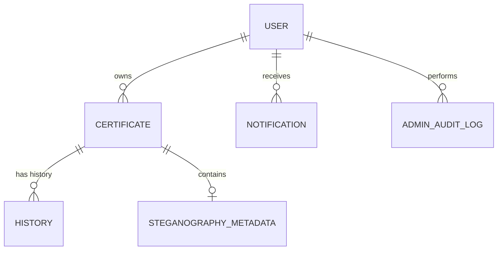

# Web Kripto Steganografi Sertifikat 🛡️📜

Sistem manajemen sertifikat digital berbasis web yang mengintegrasikan teknik **Kriptografi** dan **Steganografi** untuk menjamin keamanan, keaslian, dan integritas data sertifikat. Proyek ini dikembangkan sebagai tugas akhir untuk memfasilitasi pengelolaan sertifikat tanah/sawah secara digital dengan perlindungan data berlapis.

## 🌟 Fitur Utama

- **Pendaftaran Sertifikat**: Pengguna dapat mengajukan sertifikat tanah/sawah dengan detail lokasi (koordinat), luas, dan nomor sertifikat.
- **Steganografi LSB (Least Significant Bit)**: Menyembunyikan metadata autentikasi ke dalam citra sertifikat (PNG) tanpa merusak kualitas visual secara signifikan.
- **Verifikasi Keaslian**: Fitur verifikasi mandiri dengan mengunggah sertifikat untuk mengekstraksi pesan tersembunyi dan memvalidasi integritasnya.
- **Pengalihan Hak (Transfer)**: Mekanisme transfer kepemilikan sertifikat yang aman antar pengguna dengan persetujuan admin.
- **Riwayat Kepemilikan (History)**: Pencatatan otomatis setiap aksi (Pendaftaran, Verifikasi, Pengalihan) untuk audit trail yang transparan.
- **Sistem Notifikasi**: Pemberitahuan real-time untuk status verifikasi, penolakan, atau permintaan transfer.
- **Multi-Role User**:
  - **User**: Mengelola sertifikat pribadi, verifikasi, dan transfer.
  - **Admin**: Menyetujui pendaftaran, memantau statistik, dan mengelola audit log.
  - **Dinas**: Akses pengawasan dan pelaporan (Optional/Extended).

## 🛠️ Teknologi yang Digunakan

### Frontend & UI
- **Framework**: [Next.js 16](https://nextjs.org/) (App Router)
- **Styling**: [Tailwind CSS 4](https://tailwindcss.com/)
- **Animasi**: [Framer Motion](https://www.framer.com/motion/)
- **Komponen UI**: [Radix UI](https://www.radix-ui.com/) & [Lucide React](https://lucide.dev/)
- **Chart**: [Recharts](https://recharts.org/)

### Backend & Database
- **Runtime**: Node.js & Next.js Server Actions
- **ORM**: [Prisma](https://www.prisma.io/)
- **Database**: PostgreSQL (Supabase/Local)
- **Authentication**: Bcrypt.js (Password Hashing)

### Keamanan (Kriptografi & Steganografi)
- **PNG Analysis**: [pngjs](https://www.npmjs.com/package/pngjs)
- **Algoritma**: LSB (Least Significant Bit) untuk embedding data.
- **Integritas**: Hash-based validation untuk memastikan data tidak dimanipulasi.

## 📊 Skema Database

Sistem ini menggunakan struktur data relasional untuk menjaga integritas informasi:



## 🚀 Instalasi & Persiapan

1. **Clone Repositori**:
   ```bash
   git clone https://github.com/ridlofw/web-kripto-steganografi-sertifikat.git
   cd web-kripto-steganografi-sertifikat
   ```

2. **Instal Dependensi**:
   ```bash
   npm install
   ```

3. **Konfigurasi Environment**:
   Salin file contoh konfigurasi dan sesuaikan isinya dengan kredensial Anda (Supabase, Database, dll):
   ```bash
   cp .env.example .env
   ```
   Buka file `.env` dan isi variabel berikut:
   - `DATABASE_URL` & `DIRECT_URL` (dari setting Database Supabase)
   - `NEXT_PUBLIC_SUPABASE_URL` & `ANON_KEY` (dari setting API Supabase)
   - `STEGANOGRAPHY_KEY` (Generate random 32-byte hex string untuk keamanan)

4. **Setup Database (Prisma)**:
   ```bash
   npx prisma generate
   npx prisma db push
   npm run seed # Opsional: Untuk data awal admin/user
   ```

5. **Jalankan Aplikasi**:
   ```bash
   npm run dev
   ```
   Akses di `http://localhost:3000`

## 📖 Panduan Penggunaan

1. **Registrasi/Login**: Masuk sebagai User atau Admin.
2. **Pengajuan**: User mengunggah detail sertifikat. Sistem akan melakukan proses steganografi secara otomatis setelah disetujui Admin.
3. **Verifikasi**: Di halaman Verifikasi, unggah file sertifikat PNG yang telah diunduh. Sistem akan mengekstrak metadata dan mencocokkan dengan database.
4. **Transfer**: Masukkan email penerima untuk mengalihkan hak kepemilikan sertifikat.

## 👥 Tim Pengembang

- **Abid** - [GitHub](https://github.com/abidclassroomgit)
- **Tim Project** - Kontributor

---
*Proyek ini merupakan bagian dari tugas akhir mata kuliah Kriptografi.*
